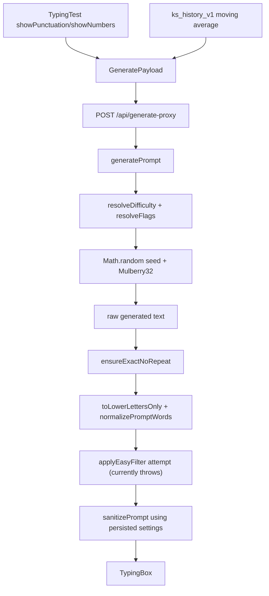

# Adaptive Test and Prompt Flow

Verified against `main` at merge commit `3c91fc0` on 2026-08-03. This document characterizes current behavior and deliberately does not repair it.

## Active initial-prompt flow

### Request construction

`src/components/typing/TypingTest.tsx` owns component-local `showPunctuation` and `showNumbers` state. On initial hydration, these values may be restored from `bk:lastTest:v1`. The active request always sends:

- the selected words/time mode;
- count or duration;
- the two component-local flags;
- `difficulty: "auto"`;
- moving-average WPM and accuracy from `ks_history_v1`.

It does not send the persisted word-set choice or `blaze: true`. Consequently, `generatePrompt` always uses `EN_CORE_5K`, and its Blaze-specific bank mix/length-cap branch is unreachable from the solo UI even when `blazeModeEnabled` is on.

The request goes to `src/app/api/generate-proxy/route.ts`, which calls `src/server/generatePrompt.ts` in the Next.js process. FastAPI is not involved in this active path.

### TypeScript generator

`src/server/generatePrompt.ts`:

1. resolves `"auto"` to easy, medium, or hard from recent WPM and accuracy;
2. uses explicit punctuation/number booleans when provided, otherwise tier defaults;
3. generates a random numeric seed with `Math.random`;
4. uses a local Mulberry32 PRNG for word selection and transformations;
5. injects at least one numeric token when numbers are enabled;
6. assembles punctuated sentences when punctuation is enabled;
7. returns text, seed, resolved difficulty, and effective flags.

The generator's local work is reproducible after a caller-supplied seed seam is added. No external model is called here.

### Client post-processing

The generated text is transformed again in `TypingTest`:

1. `ensureExactNoRepeat` normalizes the requested word count and consults persisted settings for repeat replacement.
2. `toLowerLettersOnly` lowercases letters while retaining non-letters.
3. `normalizePromptWords` normalizes whitespace/tokens.
4. `applyEasyFilter` is intended to replace every token that is not a lowercase letters-only word of at most eight characters. It currently throws because it calls nonexistent `StringLRU.add`; the surrounding `TypingTest` catch keeps the pre-filter text.
5. `sanitizePrompt` uses `useSettingsStore.getState().test`, not the component-local flags used in the request.
6. The resulting string becomes `currentPrompt` and is rendered by `TypingBox`.

If executable, `applyEasyFilter` would be a flag-loss point because it sanitizes each token with punctuation and numbers disabled. In the current runtime it fails on the first token and is silently skipped. The Phase 1 audit records both the stage error and the text that proceeds to final sanitization; it must not repair this production defect.

There is a second configuration mismatch: the request uses `showPunctuation`/`showNumbers`, while the final sanitizer and repeat limiter use persisted `bk:settings:v1` values. The UI can display one requested state while downstream processing uses another.

With default persisted flags off, sanitization removes server-injected numeric tokens completely, which can also reduce the rendered word count below the requested count.

The asynchronous `getEasyPool()` enrichment is not reached when the synchronous filter throws. Even after that defect is repaired, its callback only mutates a closed-over local `finalPrompt` after rendering has been scheduled, so it still has no verified UI effect.

## Other generation paths

- Words-mode fallback: `sampleNormalWords` in `TypingTest`; uses `randomSeed()` plus `mulberry32`, uses the persisted word set, and does not receive the filter-chip punctuation/number flags.
- Time-mode fallback: `src/lib/localPrompt.ts`; accepts a seed and content flags, but the solo caller supplies neither. Its word bank is letters-oriented, so enabling punctuation/numbers does not itself create those characters.
- Coder mode: `buildCoderPrompt`; bypasses normal easy filtering and sanitization so code punctuation/case can survive.
- Adaptive append: `src/lib/generator/adaptive.ts` is used by `memoAppendPrompt` to append weak-character-weighted words, especially for longer/time tests. It is not the active initial prompt generator.
- AI Coach drills: build local word batches and sanitize them using persisted settings.
- Party content: generated separately through `src/lib/party/contentGen.ts`.
- FastAPI `/generate`: a parallel Python implementation in `backend/app.py`; not called by the active solo flow.
- Next.js `/api/generate-text` and `src/lib/generateText.ts`: separate experimental/legacy text generators; not called by the active solo flow.

## Randomness seams

- `src/server/generatePrompt.ts`: random seed from `Math.random`, then deterministic Mulberry32.
- `src/lib/prompt/easyFilter.ts`: replacement words use `Math.random` directly.
- `src/lib/localPrompt.ts`: deterministic when `seed` is provided; otherwise time-derived.
- `sampleNormalWords` and adaptive append: deterministic when supplied a fixed PRNG, but current callers create random seeds.
- Repeat-limit filler and coder snippets create additional random choices that need injection or mocking if included in a deterministic test boundary.
- External-model output from `/api/generate-text` must not be held to exact same-seed reproducibility.

Phase 1 should add only the smallest seams needed to test local deterministic operations. External boundaries must be mocked.

## Phase 1 contract

Disabled values are hard per-sample invariants:

- `punctuation=false`: rendered output contains no punctuation.
- `numbers=false`: rendered output contains no digits.

Enabled values default to an `allowed` policy until BlazeKey approves a stronger product contract:

- `punctuation=true`: punctuation may appear.
- `numbers=true`: digits may appear.

The raw TypeScript generator currently attempts guaranteed inclusion, but that implementation detail is not yet a documented product promise. The Phase 1 audit should report batch inclusion counts and density without failing a single enabled sample merely because the optional class is absent. A future `minimum-density` policy must define its thresholds explicitly.

## Displayed versus rendered configuration

The results surface has multiple non-equivalent views of the same run:

- `smartFlags` comes from the server generator response.
- `lastUsedConfigRef` records filter-chip values and feeds selected-test chips.
- the rendered prompt reflects easy filtering plus persisted-settings sanitization.

These can all disagree. A result can report server punctuation/numbers as enabled while the rendered prompt contains neither, and selected-test chips can reflect requested local flags rather than effective rendered behavior. Phase 1 should capture requested, server-effective, and rendered observations separately.

## Existing coverage gap

`tests/e2e/smoke.spec.ts` stubs `/api/generate-proxy` without generated text, so it exercises the local fallback rather than the active server-generator pipeline. No current unit test directly covers `generatePrompt`, `applyEasyFilter`, settings/filter synchronization, Blaze request propagation, or requested-versus-rendered flags.

## Harness boundary

The first implementation branch must:

- add a caller-supplied seed only to deterministic local generation;
- validate raw generator output and the existing downstream rendered-pipeline stages separately;
- execute all four punctuation/number combinations across fixed seeds;
- emit stage, requested flags, effective flags, seed, text, inclusion metrics, and stable violation codes;
- keep characterization tests green by asserting current behavior;
- make default audit mode exit successfully while reporting product violations;
- reserve nonzero exit status for explicit strict mode;
- avoid changing `TypingTest`, `easyFilter`, settings behavior, databases, auth, or PartyKit.

The subsequent `fix/adaptive-config-pipeline` branch—not the harness branch—owns the production repair.
