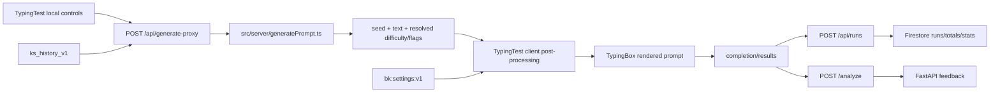

# BlazeKey Current Architecture

Verified against `main` at merge commit `3c91fc0` on 2026-08-03. This document describes current behavior; future-state proposals belong in `BLAZEKEY_AGENT_CURSOR_CONTEXT.md`.

## Runtime boundaries

- The Next.js 15 App Router application lives in `src/` and is deployed on Vercel.
- The FastAPI service lives in `backend/` and is deployed with Postgres and Caddy through `docker-compose.yml`.
- PartyKit realtime room logic lives in `party/index.ts` and is configured by `partykit.json`.
- There is no single primary database for every product concern:
  - Postgres owns username/password accounts and JWT-backed sessions.
  - Firestore owns typing runs, totals, leaderboard/profile projections, stats, streak data, and party audit/state documents used by Next.js routes.
  - PartyKit room storage owns live room state for multiplayer sessions.

## Frontend pages and API routes

The main page is `src/app/page.tsx`, which renders the solo typing experience through `src/components/typing/TypingTest.tsx`. Other page entry points include account, login, leaderboard, party lobby, party room, run detail, development console, and policy pages under `src/app/**/page.tsx`.

Next.js route handlers under `src/app/api/` form the server-side boundary used by the browser:

- `auth/*` proxies register, login, logout, and session checks to FastAPI.
- `generate-proxy` runs the active TypeScript prompt generator in-process.
- `runs`, `stats/*`, `totals/me`, `leaderboard*`, `streak/ping`, `profile/sync`, and `users/*` read or write Firestore through `src/lib/firebaseAdmin.ts`.
- `party/create`, `party/join`, and `party/rematch` coordinate Firestore records with PartyKit rooms.
- `generate-text` is a separate OpenAI/fallback experiment and is not the active solo typing path.

## Active solo typing request flow



`TypingTest` sends mode, count or duration, component-local punctuation/number flags, `difficulty: "auto"`, and moving-average WPM/accuracy. `src/server/generatePrompt.ts` resolves difficulty, selects words from `EN_CORE_5K`, optionally injects numbers and sentence punctuation, and returns the generated seed and effective flags.

The returned text is not rendered directly. `TypingTest` applies exact-count normalization, lowercasing, the letters-only easy-word filter, and a final sanitizer before passing the text to `TypingBox`. See `adaptive-test-flow.md` for the verified consequences.

Fallbacks are local:

- Words mode uses `sampleNormalWords` when the route does not return text.
- Time mode uses `generateLocalPrompt`.
- Coder mode uses `buildCoderPrompt` and bypasses normal text sanitization.

FastAPI also exposes `/generate` in `backend/app.py`, and `src/app/api/generate-text/route.ts` exposes an OpenAI-backed experiment. Neither is called by the active solo flow.

On completion, AI feedback is different: `TypingTest` posts `/analyze` directly to the FastAPI base through `src/lib/http.ts`. Run persistence uses the Next.js `/api/runs` route and Firestore.

## Authentication and data ownership

Browser auth calls Next.js `src/app/api/auth/*`. Those routes proxy to `${NEXT_PUBLIC_API_URL}/auth/*`. FastAPI's `backend/auth.py`:

- reads and writes the SQLAlchemy `User` model;
- hashes and verifies passwords;
- creates an HTTP-only `ks_session` JWT cookie;
- resolves `/auth/me` from that cookie.

`backend/database.py` requires `DATABASE_URL` in production and permits a clearly marked SQLite fallback only for local development. Alembic owns production schema creation; the current migration set contains `backend/alembic/versions/0001_initial_users_table.py`.

The authenticated username is then used by Next.js Firestore routes as the application identity for game data. Some routes retain compatibility with Firebase ID tokens or guest IDs, but Firebase Auth is not the primary username/password account store.

The Postgres `users` model still contains `xp_total` and `streak`, but the active run/streak flow updates Firestore totals and user projections instead. Those SQL columns must not be treated as the current game-stat source of truth.

## Multiplayer

Next.js party routes create and look up party metadata and call PartyKit's admin-gated HTTP control plane. `party/index.ts` stores room state in PartyKit room storage, enforces host/guest membership, runs countdown and race state, relays progress, persists finish state, and supports rematches. The six-digit public party code maps to an internal PartyKit room ID.

## Analytics and product signals

- `src/app/layout.tsx` mounts Vercel Analytics and Speed Insights.
- `src/lib/firebase.ts` contains a browser-only Firebase Analytics initializer, but no verified active caller was found during this audit.
- Product behavior is also represented by Firestore run/totals/stats records and local adaptive history (`ks_history_v1`).
- `src/lib/events.ts` defines a small internal browser-event registry; it is not a general product analytics pipeline.

## Deployment and local development

- Frontend: Vercel, with `NEXT_PUBLIC_API_URL` and Firebase credentials configured in the deployment environment.
- Backend: `docker-compose.yml` runs Postgres 16, the FastAPI image, and Caddy with automatic HTTPS.
- Local launcher: `start-local.bat` starts local dependencies and services.
- PartyKit: configured separately through `partykit.json`.

Production builds intentionally reject a missing or localhost `NEXT_PUBLIC_API_URL` in `src/lib/api.ts`.

## Current quality tooling

Package manager: npm (`package-lock.json`).

Useful commands:

```text
npm run test:unit
npm run test:e2e
npm run test:e2e:webkit
npm run type-check
npm run lint
npm run build
npm run compat:css
```

Current caveats:

- `test:unit` runs the Node test runner through `tsx` and currently targets `tests/unit/resultsSeries.test.ts`.
- Jest remains configured for `npm test`, but it is not the convention used by the existing unit script.
- Playwright runs Chromium, Firefox, and WebKit from `tests/e2e`.
- The current Playwright smoke test mocks auth and generation; it does not exercise FastAPI, Postgres, Firestore, or the active server-generated punctuation/number pipeline.
- `next.config.ts` currently skips type and lint failures during production builds.
- The repository-wide type check has known baseline errors.
- `npm run lint` still uses `next lint`, which is incompatible with the current Next.js setup.
- The CSS compatibility scan now executes correctly but reports an existing warning baseline; CI marks that step informational.
- `.github/workflows/cross-compat.yml` runs browser tests, a production build, and the informational CSS scan. It does not currently enforce unit tests, type checking, or linting.
- CI has no backend, Postgres, migration, or FastAPI integration test.
