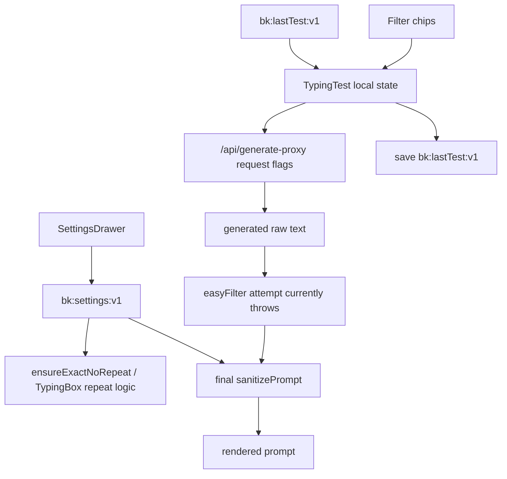

# BlazeKey Settings Flow

Verified against `main` at merge commit `3c91fc0` on 2026-08-03. Current test configuration is split across three independent state sources.

## State sources

### Persisted application settings

`src/store/settings.ts` defines `useSettingsStore`, persisted by Zustand under `bk:settings:v1`.

Relevant test defaults include:

- mode and length;
- word set;
- `include_numbers`;
- `include_punctuation`;
- repeat limit;
- stop-on-error and strict-space behavior.

`src/components/settings/SettingsDrawer.tsx` edits this store. These settings are browser-local; they are not currently persisted to Postgres or Firestore.

Not every stored default is applied by the solo boot path:

- `defaultMode` is stored but not used to initialize `TypingTest`.
- punctuation and number defaults do not initialize the filter chips; the settings drawer's “Applied on first load” copy is inaccurate for these fields.
- `wordSet` affects local fallback, repeat filler, drills, and adaptive append, but the active server generator always uses `EN_CORE_5K`.
- `blazeModeEnabled` exists in defaults/UI behavior but is missing from the declared `SettingsState.test` type and is never sent as `blaze: true` to the active generator.

### Current typing-screen controls

`src/components/typing/TypingTest.tsx` separately initializes:

```text
showPunctuation = false
showNumbers = false
```

The filter-bar chips update only these component-local values and restart the test with request overrides. They do not update `useSettingsStore`.

### Last-used test configuration

`src/stores/useLastTestStore.ts` persists `bk:lastTest:v1`. It stores mode, count/duration, and punctuation/number values from the component-local controls.

On mount, `TypingTest` reads this store (or localStorage directly during a hydration race) and copies saved values into its local state. This means the last-used test can take precedence over settings-drawer defaults without an explicit canonical precedence policy.

## Current flow



## Verified precedence and mismatches

There is no single validated effective configuration object.

1. Hard-coded `TypingTest` defaults are created first.
2. `bk:lastTest:v1`, when present, hydrates the component-local test controls.
3. Filter-chip interactions change component-local state and request overrides.
4. `bk:settings:v1` remains independently editable in the settings drawer.
5. Prompt generation uses the component-local values.
6. Exact-count repeat replacement, the final sanitizer, adaptive append, TypingBox repeat limiting, and AI Coach drill sanitization consult persisted settings.
7. `applyEasyFilter` is intended to remove/replace non-easy tokens regardless of either state source, but currently throws on nonexistent `StringLRU.add`; `TypingTest` catches the error and continues with the pre-filter text.

Consequences:

- The active chip can say punctuation or numbers are enabled while the rendered prompt contains neither.
- The settings drawer can disagree with the active chips.
- A server response can accurately report enabled effective flags even though later client stages remove the corresponding content.
- Results can show server `smartFlags`, selected-test chips from local requested values, and rendered text with three different effective stories.
- Last-test persistence can restore a state different from current settings defaults.
- Enabling Blaze mode changes interlude/prefetch presentation but does not activate the server's Blaze generation branch.
- Coder mode follows a different policy because it intentionally preserves code punctuation and casing.

## Other settings storage

Additional browser-local keys exist outside the main settings store:

- `ks_history_v1`: recent WPM/accuracy used for automatic difficulty.
- `bk-recent-words`: recent-word LRU used by local samplers.
- `bk:coder:lang`: coder language selection.
- command-hint keys written alongside settings updates.

`useUIStore` manages transient UI state such as whether settings/focus overlays are open. It is not the source of typing-content flags.

## Intended repair boundary

Phase 2 should define one canonical requested/effective test configuration and an explicit precedence order. A reasonable target is:

```text
application defaults
  -> persisted user/browser preferences
  -> current-session or filter-bar overrides
  -> boundary validation
  -> immutable effective configuration
  -> generator and every downstream transform
```

That repair must be driven by the Phase 1 audit. The documentation and harness branches must not silently synchronize stores or change rendered behavior.

Server-side preference persistence is a later design decision. If implemented, it must account for the current split data model: Postgres owns accounts, while Firestore owns game data. The storage choice must be explicit rather than assumed from the word “user.”
