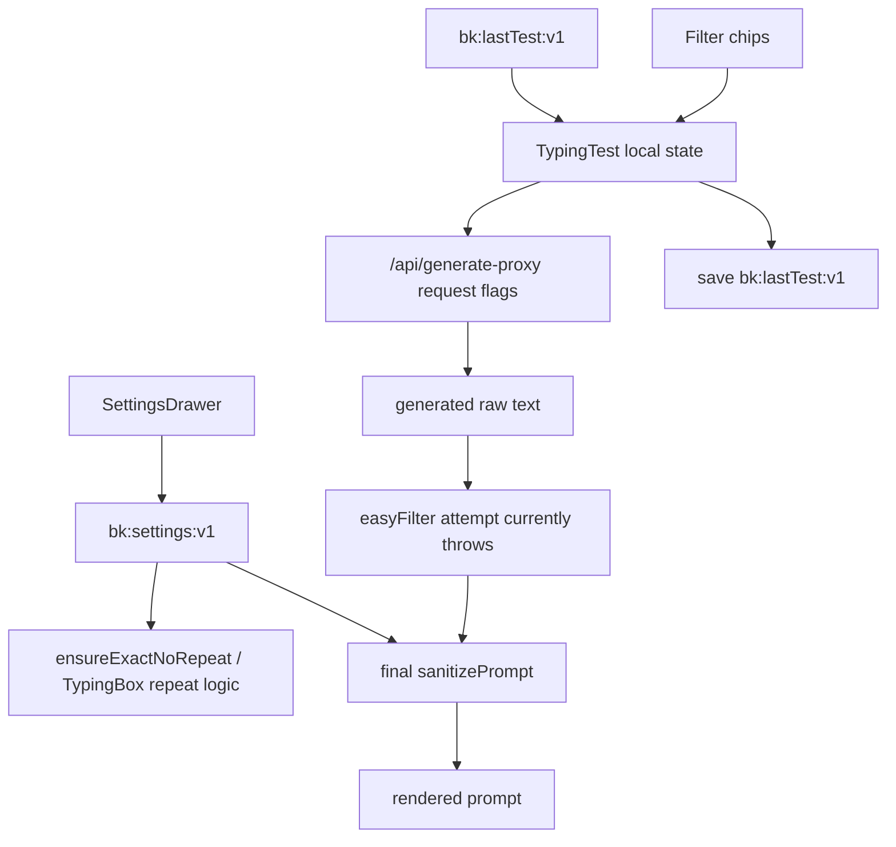

# BlazeKey Settings Flow

Verified against `main` at merge commit `3c91fc0` on 2026-08-03. Current test configuration is split across three independent state sources.

## State sources

### Persisted application settings

`src/store/settings.ts` defines `useSettingsStore`, persisted by Zustand under `bk:settings:v1`.

Relevant test defaults include:

- mode and length;
- word set;
- `include_numbers`;
- `include_punctuation`;
- repeat limit;
- stop-on-error and strict-space behavior.

`src/components/settings/SettingsDrawer.tsx` edits this store. These settings are browser-local; they are not currently persisted to Postgres or Firestore.

Not every stored default is applied by the solo boot path:

- `defaultMode` is stored but not used to initialize `TypingTest`.
- punctuation and number defaults do not initialize the filter chips; the settings drawer's “Applied on first load” copy is inaccurate for these fields.
- `wordSet` affects local fallback, repeat filler, drills, and adaptive append, but the active server generator always uses `EN_CORE_5K`.
- `blazeModeEnabled` exists in defaults/UI behavior but is missing from the declared `SettingsState.test` type and is never sent as `blaze: true` to the active generator.

### Current typing-screen controls

`src/components/typing/TypingTest.tsx` separately initializes:

```text
showPunctuation = false
showNumbers = false
```

The filter-bar chips update only these component-local values and restart the test with request overrides. They do not update `useSettingsStore`.

### Last-used test configuration

`src/stores/useLastTestStore.ts` persists `bk:lastTest:v1`. It stores mode, count/duration, and punctuation/number values from the component-local controls.

On mount, `TypingTest` reads this store (or localStorage directly during a hydration race) and copies saved values into its local state. This means the last-used test can take precedence over settings-drawer defaults without an explicit canonical precedence policy.

## Current flow



## Verified precedence and mismatches

There is no single validated effective configuration object.

1. Hard-coded `TypingTest` defaults are created first.
2. `bk:lastTest:v1`, when present, hydrates the component-local test controls.
3. Filter-chip interactions change component-local state and request overrides.
4. `bk:settings:v1` remains independently editable in the settings drawer.
5. Prompt generation uses the component-local values.
6. Exact-count repeat replacement, the final sanitizer, adaptive append, TypingBox repeat limiting, and AI Coach drill sanitization consult persisted settings.
7. `applyEasyFilter` is intended to remove/replace non-easy tokens regardless of either state source, but currently throws on nonexistent `StringLRU.add`; `TypingTest` catches the error and continues with the pre-filter text.

Consequences:

- The active chip can say punctuation or numbers are enabled while the rendered prompt contains neither.
- The settings drawer can disagree with the active chips.
- A server response can accurately report enabled effective flags even though later client stages remove the corresponding content.
- Results can show server `smartFlags`, selected-test chips from local requested values, and rendered text with three different effective stories.
- Last-test persistence can restore a state different from current settings defaults.
- Enabling Blaze mode changes interlude/prefetch presentation but does not activate the server's Blaze generation branch.
- Coder mode follows a different policy because it intentionally preserves code punctuation and casing.

## Other settings storage

Additional browser-local keys exist outside the main settings store:

- `ks_history_v1`: recent WPM/accuracy used for automatic difficulty.
- `bk-recent-words`: recent-word LRU used by local samplers.
- `bk:coder:lang`: coder language selection.
- command-hint keys written alongside settings updates.

`useUIStore` manages transient UI state such as whether settings/focus overlays are open. It is not the source of typing-content flags.

## Intended repair boundary

Phase 2 should define one canonical requested/effective test configuration and an explicit precedence order. A reasonable target is:

```text
application defaults
  -> persisted user/browser preferences
  -> current-session or filter-bar overrides
  -> boundary validation
  -> immutable effective configuration
  -> generator and every downstream transform
```

That repair must be driven by the Phase 1 audit. The documentation and harness branches must not silently synchronize stores or change rendered behavior.

Server-side preference persistence is a later design decision. If implemented, it must account for the current split data model: Postgres owns accounts, while Firestore owns game data. The storage choice must be explicit rather than assumed from the word “user.”

## Phase 2 ownership

The repaired initialization precedence is explicit restart/chip override, valid last-used configuration, persisted settings defaults, then application defaults. The selected configuration is copied into an immutable current-test snapshot.

The settings drawer remains the source of defaults for future tests. Filter chips construct a new current-test configuration and do not write global defaults. After initialization, persisted setting changes do not mutate the active prompt. Last-test persistence stores the canonical configuration and migrates the legacy count/duration and snake-case flag shape.

Results use the content-derived effective configuration from the finalized prompt. Resolved adaptive difficulty is separate metadata and does not override rendered punctuation or number flags.

## Phase 3 persistence implementation

Phase 3 keeps the existing settings UI and adds a versioned persistence boundary below
it.

### Ownership and schema

- `src/lib/settings/preferencesSchema.ts` owns preference schema version 1, runtime
  normalization, deterministic serialization, migration, and the application defaults.
- Test defaults in that object derive from Phase 2's `APPLICATION_TEST_CONFIG`; literals
  for punctuation, numbers, word count, word set, and repeat limit are not duplicated.
- The persistable groups are the existing `commands`, `test`, `ai`, `fx`, `focus`,
  `appearance`, and `privacy` data. Zustand actions, sync status, metadata, and proposed
  future settings are not persisted as preferences.
- Invalid values fall back field-by-field. Missing groups are filled, unknown fields are
  dropped, malformed nested objects cannot throw, and unknown schema versions normalize
  safely to the current version.

### Local and remote persistence

- `bk:settings:v1` remains the immediate Zustand/localStorage cache for every user. Its
  Zustand envelope is version 2 and migration is additive; the storage key is unchanged.
- Guests never call `/api/settings` and remain fully local-only.
- Authenticated preferences live in Firestore at
  `user_settings_v1/{usernameLower}`. `usernameLower` comes only from
  `getCurrentAppUsername` plus `usernameLowerOf` on the server.
- `GET /api/settings` returns normalized preferences, `null` for a missing document or
  guest, and `syncEnabled: false` when the kill switch is off. It never creates a
  document.
- `PUT /api/settings` requires the app session, normalizes the supplied preference
  object, and writes only the resolved user's document. The request cannot choose an
  identity or document path.
- Firestore rules deny all direct client access to `user_settings_v1`; the Admin SDK
  route is the only read/write path. A single document lookup requires no new index.

### First-login adoption

After local hydration and authentication, a missing remote document triggers an
`adoption: true` PUT with the normalized local preferences. The route performs the
existence check and create in one Firestore transaction. If another request created the
document first, the established remote record is returned and applied; it is never
overwritten by the adoption attempt. Document existence is the durable one-time marker,
and a successful seed also records `adoptedFromLocalAt`. Malformed local data is
normalized before adoption. A failed adoption leaves local settings intact and retries
safely on a later change or auth refresh.

### Precedence and hydration

For a new solo test, precedence remains:

```text
application defaults
  -> normalized local cache or authenticated remote preferences
  -> valid last-used configuration
  -> explicit current-session/restart override
  -> immutable active-test configuration
```

Initialization runs in this order:

```text
Zustand local hydration
  -> authentication resolution
  -> remote read / transactional adoption / local-only fallback
  -> normalized settings store
  -> Phase 2 initial-config resolver
  -> active finalized prompt snapshot
```

The settings-sync request is time-bounded. API, authentication, Firestore, or malformed
remote failures settle to usable local settings rather than blocking typing. Once
`TypingTest` has resolved its initial configuration, later preference hydration or writes
do not rerun that initialization and cannot mutate the current finalized prompt.

### Optimistic writes, failure, and rollback

Store changes update local state immediately and debounce authenticated PUTs by 650 ms.
Successful responses become the new local/remote baseline; applying a response is
suppressed from the write subscription to prevent hydration loops. A failed PUT keeps
the local optimistic value, exposes `unsynced` state plus a
`bk:settings-sync-error` browser event, and records a username-scoped pending write at
`bk:settings:pending:v1`. There is no automatic infinite retry loop.

`SETTINGS_SERVER_SYNC` defaults on. Set it to `0`, `false`, `off`, `disabled`, or `no`
to make the client retain local-only behavior without deleting Firestore documents or
changing the schema. Reverting the branch also leaves the existing local storage key
readable because migration is additive.

### Conflict resolution (actual behavior)

Multi-device conflict handling is **arrival-order, full-document last-write-wins**. Each
successful `PUT` replaces the user's document with the complete normalized preference
object; whichever write reaches Firestore last wins. `updatedAt` is stored as metadata
only — it is **not** used as a write precondition, and there is no per-field merge or
optimistic-concurrency check. True multi-device conflict resolution (per-field merge or
`updatedAt`/version preconditions) is a deliberate **follow-up**, not part of this phase.

### Account isolation (cross-account leak prevention)

The shared `bk:settings:v1` local cache records an owner in `bk:settings:owner:v1`
(`null` for a guest, or the authenticated `usernameLower`). On an authenticated identity
transition the cache is isolated **before** remote resolution:

- If the local cache belongs to a different authenticated user, it is reset to
  application defaults before reading the remote document, so a new user's empty remote is
  never seeded from a previous user's cache.
- A guest cache with no prior authenticated owner is still adoptable on first login.
- Logout resets the cache to defaults, clears the owner, and clears any pending write,
  leaving a deterministic safe state.
- Pending writes stay identity-scoped (`usernameLower`), so a failed write for one user is
  never applied under another.

### Unsupported future remote schema

If a remote document declares `schemaVersion` greater than this build's
`PREFERENCES_SCHEMA_VERSION`, `GET /api/settings` flags it (`unsupportedSchema: true`).
The client keeps the app usable on safe local settings and **suspends all writes** for the
session, so the newer server record is never downgraded to v1 or overwritten, and no
write-back loop occurs. Existing v1 and legacy documents continue to normalize normally.

### Bounded first-test boot

First-test boot waits for the settings hydration to settle, but is bounded by a total
fallback (`BOOT_SETTINGS_FALLBACK_MS`). If auth (`/api/auth/me`) or settings resolution
stalls past that bound, boot proceeds from safe locally-hydrated/default settings so the
typing prompt is never blocked indefinitely. Remote preferences that arrive after the
fallback update defaults for the next test only; the already-active Phase 2 prompt is
never mutated.
